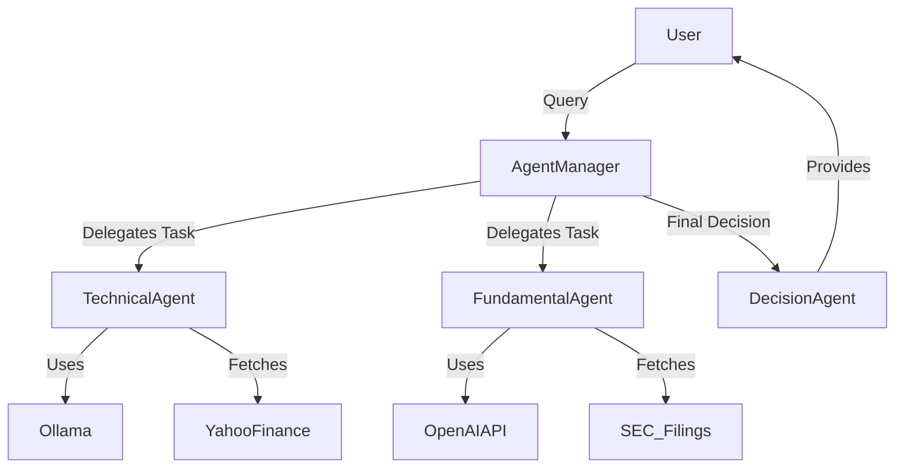

# 🧠 AI Agents from Scratch in Python

This repository contains a collection of AI agents implemented from scratch in Python. These agents leverage **local LLM providers** like [Ollama](https://ollama.ai/) running on a local machine, or **remote LLM APIs** such as OpenAI's ChatGPT API. The goal of this project is to build modular, intelligent agents that can perform specialized tasks autonomously.

## 🚀 Features

- **Multi-Agent Collaboration**: Agents interact to solve complex tasks efficiently.
- **Local & Remote LLM Support**: Choose between **Ollama** (local) and **ChatGPT API** (remote).
- **Custom AI Pipelines**: Each agent is designed for a specific task with well-defined inputs and outputs.
- **Extensible Design**: Easily add new agents to expand capabilities.
- **Streamlit UI Support**: Some agents come with an interactive web-based interface.

---

## 📌 List of AI Agents

| Agent Name                  | Functionality                                           | LLM Provider |
|-----------------------------|--------------------------------------------------------|--------------|
| 📈 **Stock Analysis Agent**  | Analyzes stocks based on fundamentals & technicals   | Ollama, ChatGPT API |

---

## 🔧 Installation

### 1️⃣ Clone the Repository
```bash
git clone https://github.com/yourusername/AI-Agents.git
cd AI-Agents
```

### 2️⃣ Set Up a Virtual Environment
```bash
python -m venv venv
source venv/bin/activate   # On Windows: venv\Scripts\activate
```

### 3️⃣ Install Dependencies
```bash
pip install -r requirements.txt
```

### 4️⃣ Install & Run Ollama (Optional for Local LLMs)
```bash
curl -fsSL https://ollama.ai/install.sh | sh
ollama serve
```

For more details, visit Ollama’s official site.

### 5️⃣ Set Up API Keys (For Remote LLMs)
If using OpenAI’s API, create an .env file:
```bash
echo "OPENAI_API_KEY=your_api_key_here" > .env
```

## 🏗️ Agent Architecture
The agents follow a modular structure:

Agents: Independent components handling specific tasks.
LLM Providers: Local or remote models powering the agents.
Data Sources: APIs like Yahoo Finance, VirusTotal, SEC filings, etc.

### Workflow Diagram


## 📜 Usage
Running a Specific Agent
```bash
streamlit run <agent>/app.py
```

## 📌 Roadmap
- ✅ Implement Stock Analysis Agent
- ✅ Integrate Ollama for local processing
- 🏗️ Add Multi-Agent Coordination Framework
- 🏗️ Develop More domain-specific AI agents
- 🏗️ Optimize LLM usage for better performance

## 🤝 Contributing
    We welcome contributions! To contribute:
    1. Fork the repo 📌
    2. Create a branch (git checkout -b feature-xyz)
    3. Commit your changes (git commit -m "Added XYZ agent")
    4. Push to GitHub (git push origin feature-xyz)
    5. Open a Pull Request 📩

## 🛠️ Technologies Used
- Python (Core Language)
- Streamlit (Web UI for agents)
- Ollama (Local LLMs)
- OpenAI API (Cloud-based LLMs)
- Yahoo Finance API (Financial Data)
- SEC Filings (Annual Report Analysis)

## 📜 License
This project is licensed under the MIT License.

